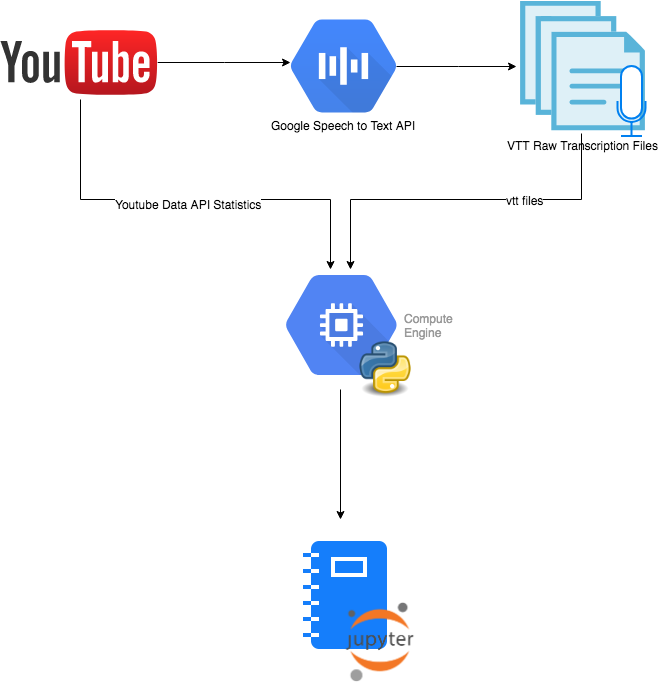
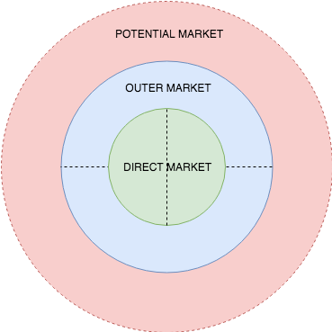
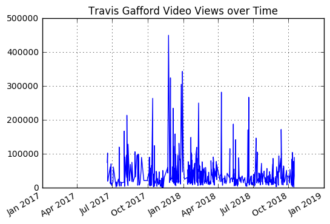
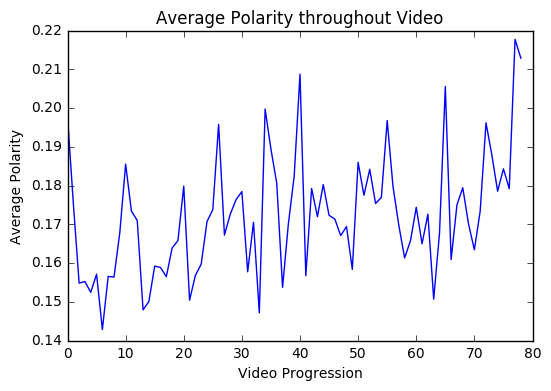
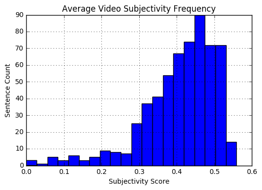
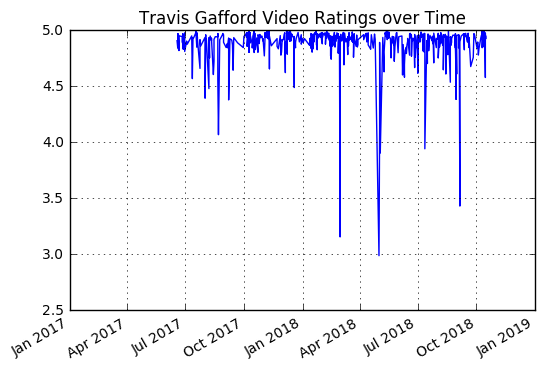

# Quantitative Youtube Content Analysis for eSports Channel Growth

## 1.0 Introduction

This project aims to scientifically analyze the content of Youtube videos in order to determine recommendations for channel growth. Youtube and Google provides a suite a tools that can be creatively used to analyze content, where other analytics sites such as SocialBlade do not take advantage of.

The subject of focus is Travis Gafford, an eSports freelance interviewer who primarily interviews professional League of Legends Players in North America. He has struggled with channel and viewership over the past year despite the massive growth of the eSports overall.
Channel: https://www.youtube.com/user/stateoftheleague

Travis is a well-respected, well-known interviewer, and is often associated as the "face" of League of Legends interviews - but why does his viewership slack? 

Please open the travis_analytics.ipynb for the entire analysis.

## 2.0 Insfrastructure and Approach

This project was built on top of Google Cloud Platform's Compute Engine.

__Overview__
 

### 2.1 Part I: Transcribe Video Content using Google's Speech to Text API

It's hard to quantify how "good" or "bad" the content within a Youtube video is with limited subjectivity. At the core of the Youtube video (especially interviews), it's about what is said in the video. Therefore, I needed to figure out a way to get the content accurately. Recently, I noticed the captions in Youtube have significantly improved, I thought that there should be an API for it. 

Fortunately, there is Google's Cloud Speech to Text functionality that works flawlessly with Youtube https://cloud.google.com/speech-to-text/. There's also a popular Open Source project called Youtube-dl (https://rg3.github.io/youtube-dl/), which allowed me to download all the transcriptions at once.

Simply: _youtube-dl --write-thumbnail --write-auto-sub --skip-download -o https://www.youtube.com/user/stateoftheleague_

### 2.2 Part II: Get Statistics from all videos

Youtube Data API was a bit messy and finicky to work with, instead of using the API directly, I used youtube-dl again to just download the files along with metrics such as video duration, ratings, view counts, etc.

_youtube-dl --write-thumbnail --write-auto-sub --skip-download -o '%(id)s%%-%(upload_date)s%%-%(title)s%%-%(uploader)s%%-%(duration)s%%-%(view_count)s%%-%(like_count)s%%-%(dislike_count)s%%-%(average_rating)s%%-%(resolution)s.%(ext)s' https://www.youtube.com/user/stateoftheleague_

Retrieved the entire dataset videos and converted statistical information into a JSON object to feed into the analysis later.

The dataset included a total of:
 
__596 videos__
 
__2250365 words__

### 2.3 Step III: Spin up a VM instance on the Google Cloud Platform

Without __GCP__, my computer would've become a hot AC for the cold Toronto winters. Using __pandas__ and __numpy__, I was able to quickly import, read, and work with the data produced from before. __MatPlotLib__ also does an amazing job visualizing the data.

The most time consuming part was analyzing the sentiment of 2250365 words. It was taking 6+ hours on my computer vs. 3 minutes on GCP.

## 3.0 Method behind the Madness - the Analysis

### 3.1 Establish a "Market" for Videos and Set Your Competitors

Videos are like products, and channels are like business owners. You have to know what products you are selling and how you fare against competitors. It's essential to be wary of the potential threats entering your space when the barrier of entry is low, and at any time, large corporations can swallow small channels immediately.

On the other hand, it's crucial to understand the potential of the market you are in and if you are riding the growth wave or not. Even if your growth is decent, gaps between growth rates in the industry is a better indicator on performance. 

Solely focusing on your market share just isn't enough – I believe there are three types of market shares to consider:
__Direct Market__, __Outer Market__, and __Potential Market__.

In this case, the Direct Market for Travis is shared between the Score eSports, and the Blitz eSports, who all share similar views and subscribers as Travis.

The Outer Market are threats who are looking to enter the space. ESPN is quickly investing into the eSports space and with a reknowned background, reputation and following, it will be hard to beat their scale and production value.

The Potential Market is the total audience in the industry. For Travis, this is a huge number because the League of Legends the social media following of eSports players ranges between hundreds of thousands to millions, dwarfing Travis' following.

### 3.2 Content Analysis

### 3.2.1 Views over Time

First, I wanted to understand how Travis performed overall. It seems like Travis hit a peak, but his viewership steadily declined over time. 

### 3.2.2 Analyze the Sentiment of all Video Transcripts

__Average Polarity of Videos over the course of a Video__
 
Taking all 596 videos, I measured how positive/negative Travis is over the course of a video. 
As shown below, it looks like Travis starts off the video neutrally, and ends off his videos very positively.
_This makes sense_ because Travis usually starts unenthusiastic, but by the time it gets to his sponsors at the end, he raises the positivity level. This could be a huge weakness - in order to attract a larger audience, if he is unenthusiastic at the beginning, it will likely cause a more significant bounce rate, and it'll be harder to retain the viewer.

__Average Video Subjectivity__
 
As a journalist in the gaming industry, having extremes of either purely objective thoughts or purely subjective thoughts can be boring. Referring to the graph below, it looks like Travis keeps a good balance.

### 3.2.3 Analyze the Likes

Likes/Ratings is a strong performance indicator to decide whether or not people like Travis' content. It seems that his video ratings are all very high with a few dips occasionally. This is a good sign as this demonstrates his content meets the stadard of quality for his viewers.

## 4.0 Recommendations

I. __Increase positivity of videos at the beginning to improve User Retention__
 
New viewers tend to judge videos very early on and would bounce out of the video if it is uninteresting. If a user opens a Travis video and he always appears unenthusiastic, then it may be hard to attain further viewers. Furthermore, even for loyal viewers, if Travis is only enthusiastic while promoting sponsors, he may be deemed in a negative light over time.

II. __Collaborate with Influencers; don't just interview Pros__
 
In the eSports scene, the usually the people with most followers are influencers (Twitch Streamers). These influencers have followers upwards of 1M+ , while Pros usually hover around 300K. Travis' primary product are interviews with Pros; while this is good for the industry, it will be hard to reach out to further audiences. By collaborating with influencers, Travis can move outside of his primary market and gain exposure to markets who may have never heard of Travis before to spark interest. Despite Travis' high quality videos (as determined by ratings) and well-balanced content, I suspect his viewership primarily revolves around returning patrons, instead of fresh viewers. By collaborating and effectively showing his content to new viewers, this will increase the volume of traffic from previously unaware users. As shown in the _Views over time_ Graph, it is evident he has clear "home-run" videos. But those are not at random; they were all in collaboration with influencers which significantly boosted viewership. Yet, Travis does not have many influencer video products. Thus, expanding his product line is highly recommended.

III. __Be wary of large Corporations; stay true to the brand__
 
eSports is massive industry, with large companies taking over the space rapidly. As a small freelancer, if Travis is unable to produce content that meets the production value, speed, and scale of these large companies, Travis will be swallowed. The most unique selling point of Travis' product is the personal one-on-one relationship he has with his interviewees. Maintaining the fun and light-hearted atmosphere where professional corporations cannot will be a strong value proposition for Travis.

## 5.0 Work in Progress

I. __Analyzing the polarity of titles__
 
i.e. consider which words correlate with the most views, do length of titles correlate with viewership, possibly incorporating machine learning to generate the most popular titles

II. __Analyze thumbnails__
 
Using Python OpenCV package to quantify images (i.e. which colours are the most popular, does simiplicity of an image correlate with more views or vice versa, does consistency of colours correlate with more views)

III. __Re-do entire analysisw with other channels and evaluate findings__
